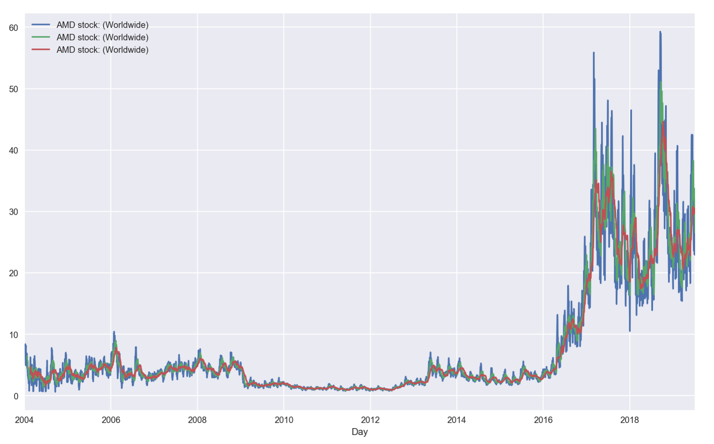
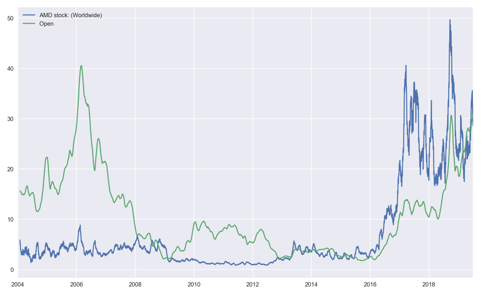

#  ✨ DailyTrends [FRESH VERSION (3.1)] ✨
[](https://pepy.tech/project/dailytrends/week)
[](https://pepy.tech/project/dailytrends/month)


#### [!] All bugs fixed. 

- The timerange can now be specified approximately.
- The region (geo) can now be specified.


###  Purpose

This lightweight API solves the problem of getting only monthly-based data for large time series when collecting Google Trends data. No login required. For unlimited requests, I will implement a Tor-based solution soon.

### Installation

```bash
$ pip install DailyTrends
```


### Usage

```python3
>>> from DailyTrends.collect import collect_data

# Get the data directly into python.
# The returned dataframe is already indexed and ready for storage/analysis.
# the end of the series defaults to "TODAY".
# the start of the series defaults to "2004-01-01".
# The geo parameter defaults to "", which yields global results.

>>> data = collect_data("AMD stock",start="2004-01-01", end="2019-07-06",
                    geo="", save=False, verbose=False)    

>>> data.info()
```

```python3
<class 'pandas.core.frame.DataFrame'>
DatetimeIndex: 5666 entries, 2004-01-01 to 2019-07-06
Freq: D
Data columns (total 1 columns):
AMD stock: (Worldwide)    5666 non-null float64
dtypes: float64(1)
memory usage: 88.5 KB
```

```python
# Plotting some rolling means of the daily data
>>> ax = data.rolling(10).mean().plot();
>>> data.rolling(25).mean().plot(ax=ax);
>>> data.rolling(50).mean().plot(ax=ax)
```



### Add your own data
```python3
# In this case the historic prices of the stock
>>> import pandas as pd
>>> price_data = pd.read_csv("price_data.csv")
>>> merged = pd.merge(price_data, data,
                  left_index=True, right_index=True)
>>> merged[["AMD stock: (Worldwide)", "Open"]].rolling(30).mean().plot()
```


### Load multiple queries

```python
>>> data = collect_data(["Intel", "AMD"],start="2004-01-01", end="TODAY",
                    geo="DE", save=False, verbose=False)      
                
```


### To-Do

- Add Tor-Network-based requests


## **Disclaimer**

This API is *not* supported by Google and is for experimental purposes only.


